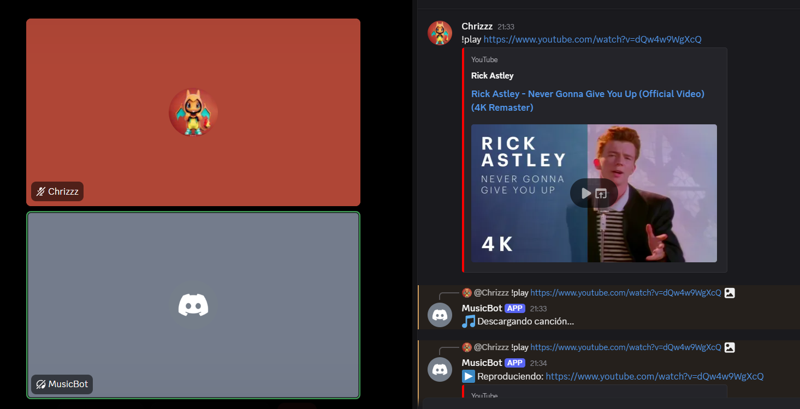

# Discord Music Bot

# Create the bot
First we have to create a Bot in Discord and enabled the following privileges
- Presence Intent
- Server Members Intent
- Message Content Intent

Before you have to create an **.env** file and save your Token inside that file
```bash
# .env
TOKEN=<bot-token>
```
This is our environment variable to access the bot

In the **OAuth2** section, we selected the bot permissions 
**(In OAuth2 -> OAuth2 URL Generator)**
- bot

**(In OAuth2 -> Bot Permissions)**
- View Channels
- Send Messages
- Read Message History
- Connect
- Speak

Copy the URL and selected the server 

## Environment
```bash
python -m venv venv
# Enter the environment
# Linux
source venv/bin/activate
# Windows
.venv/Scripts/activate
# Install yt_dlp
pip install yt-dlp
```
## Clone repository
```bash
# Clone GitHub reposotory
git clone https://github.com/Chriss5-2/MusicBot.git
```
----
----
----
# V1.0

##  Structure
```bash
# ls -a
-rw-r--r-- 1 CHRISTIAN 197609   79 Oct 18 17:29 .env
-rw-r--r-- 1 CHRISTIAN 197609  466 Oct 18 18:18 download.py
-rw-r--r-- 1 CHRISTIAN 197609 1875 Oct 18 18:14 index.js
drwxr-xr-x 1 CHRISTIAN 197609    0 Oct 18 18:08 venv/
```
Is important to have these files in our directory **download.py**, **index.js**, **.env**

## Running the bot
```bash
# Create package.json
npm init -y
# Install Node dependences
npm install discord.js @discordjs/voice dotenv @discordjs/opus

# Running the bot
node index.js
```
If index.js run well is going to display the following answer:
```bash
[dotenv@17.2.3] injecting env (1) from .env -- tip: ⚙️  enable debug logging wit
h { debug: true }
✅ Bot conectado como MusicBot#7126
```
In this case MusicBot is the BotName

## Use the bot
To use the bot we have to enter a voice room on the server that was selected when adding the bot, and in that chat room, write the next sentence with your respective URL about your music from youtube:
```bash
!play <youtube_URL>
```

## Version
Until this version, the bot compile two files [**index.js**](index.js) and [**download.py**](download.py) the index.js script is going to connect our bot and we can to call this bot with an youtube URL to reproduce the music, similar tu run **python download.py "URL"**.
Explanation: 

[download.py](download.py) is going to download the music in our local machine like an .mp3 file and then is it will be reproduce in the Discord Channel Voice
This way have a lot of disadvantages but it will be our base to our Discord Music Bot

---

# V2.0
## Creating get_url.py
We don't want to download all the music on our machine, because that causes storage issues, so to solve this problem, in this version, we implemented the [**get_url.py**](get_url.py) script. 
This script receives an argument (**url**), and generates a **direct audio stream URL**.
That URL will then be passed to the new [**index.js**](index.js) script.

## Updating index.js
Since get_url.py now generates a direct stream URL, we no longer need to read and play a local file created by [**download.py**](download.py) .The new **index.js** only need to read the url returned by [**get_url.py**](get_url.py) avoiding the need to store music files locally
### Version 1:
At first we replace the **download.py** call with a **get_url.py** execution using:
```javascript
exec(`python get_url.py "${url}"`, (error, stdout, stderr) => {
  if (error) {
    console.error(`Error al obtener URL: ${error.message}`);
    return message.reply('❌ No pude obtener el audio.');
  }

  const audioUrl = stdout.trim();
  console.log('🎶 Stream URL:', audioUrl);

  const connection = joinVoiceChannel({
    channelId: voiceChannel.id,
    guildId: message.guild.id,
    adapterCreator: message.guild.voiceAdapterCreator,
  });

  const resource = createAudioResource(audioUrl, { inlineVolume: true });
  const player = createAudioPlayer();

  player.play(resource);
  connection.subscribe(player);

  player.on(AudioPlayerStatus.Idle, () => connection.destroy());
  message.reply(`▶️ Reproduciendo: ${url}`);
```
This script worked, but we found a potential issue.
If the Youtube video is too long or slow to process, the Python script might take extra time, and the bot could try to play the audio before the URL was ready, causing and empty stream and crashing the bot.
### Version 2:
To fix that bug, we now use [**await**](https://developer.mozilla.org/en-US/docs/Web/JavaScript/Reference/Operators/await) with **get_url.py**, and with this function, we ensure that the bot always waits until the Python script has fully finished before proceeding to play the audio.
```bash
<...>
const util = require('util');
<...>
# Creating a promise
const execPromise = util.promisify(exec);

<code...>

# Executing get_url.py with await
try {
    // 👇 Espera a que Python termine, sin bloquear
    const { stdout } = await execPromise(`python get_url.py "${url}"`);
    const audioUrl = stdout.trim();
    console.log('🎶 Stream URL:', audioUrl);

    const connection = joinVoiceChannel({
      channelId: voiceChannel.id,
      guildId: message.guild.id,
      adapterCreator: message.guild.voiceAdapterCreator,
    });

    const resource = createAudioResource(audioUrl, { inlineVolume: true });
    const player = createAudioPlayer();

    player.play(resource);
    connection.subscribe(player);

    player.on(AudioPlayerStatus.Idle, () => connection.destroy());
    message.reply(`▶️ Reproduciendo: ${url}`);
  } catch (error) {
    console.error('Error:', error);
    message.reply('❌ Ocurrió un error al obtener el audio.');
  }
```
With this script, the bot became more stable, asynchronous and efficient by waiting for the Python script to finish generating the direct stream URL before playing the audio

#### by: Christian Luna
